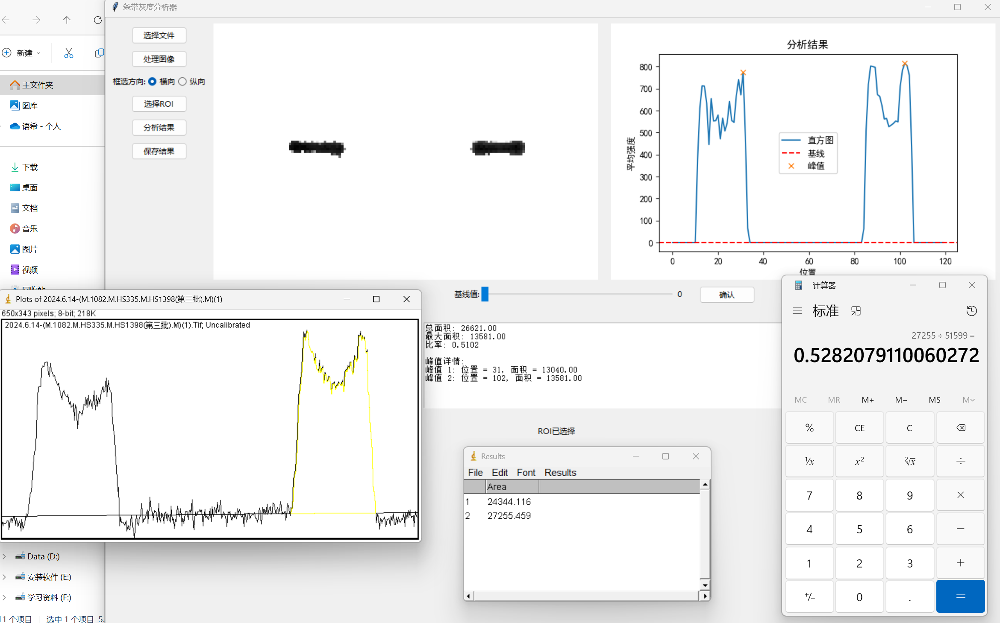

# **条带灰度分析器使用说明**

**说明：代码基本复现了ImageJ软件的功能，采用的计算方法相同，计算出的面积数值和软件算出的结果有区别，但是算出的比例基本近似，因此影响可忽略。**

**从下图可以看到，二者得到的比例基本相等(0.51和0.52)，并且人工使用ImageJ软件确定基线的时候存在手工误差，所以已经是很接近的了。**



**注：不进行背景处理的结果也基本相同**


## Python及必要库安装

**开发时使用的是python 3.9版本，以下是程序所用到的库**

```bash
pip install opencv-python numpy scipy Pillow tifffile openpyxl matplotlib
```

## 1. 如何使用

### 选择文件

1. 打开程序界面。
2. 点击“选择文件”按钮。
3. 在弹出的文件选择对话框中，选择需要分析的 TIFF 图像文件。
4. 选择完成后，图像将显示在界面的左侧区域。

### 处理图像

1. 点击“处理图像”按钮。
2. 程序会提示是否进行背景去除。可以选择使用 Rolling Ball 算法进行背景去除。
3. 处理完成后，图像将显示在界面的左侧区域。

### 选择 ROI

1. 点击“选择 ROI”按钮。
2. 在图像中框选感兴趣的区域。
3. 选择完成后，该区域的图像将显示在界面的左侧区域。
4. 根据选择的框选方向（横向或纵向），程序会生成对应的灰度直方图。

### 分析结果

1. 点击“分析结果”按钮。
2. 程序会自动分析选定 ROI 区域的灰度直方图，识别出峰值点并计算每个峰值的面积。
3. 分析结果将在界面的右侧显示。
4. 根据图像，滑动滑块来调整水平基线。

### 保存结果

1. 点击“保存结果”按钮。
2. 程序会提示选择保存位置和文件名。
3. 可以将分析结果保存到已创建的 Excel 文件中。如果文件为空，程序将自动添加表头信息。

## 2. 算法介绍

### 背景去除

使用 Rolling Ball 算法进行背景去除，将图像进行平滑处理。该算法通过模拟一个滚动的球体来估计图像的局部背景，并从原始图像中减去这个背景，从而突出图像的前景部分。

### 灰度直方图

根据选定的 ROI 区域，计算该区域的灰度直方图。对于横向选择，直方图的 x 轴代表水平位置，y 轴代表该位置的灰度值总和；对于纵向选择，直方图的 x 轴代表垂直位置，y 轴代表该位置的灰度值总和。

### 峰值识别

使用 SciPy 库中的 `signal.find_peaks()` 函数来识别直方图中的峰值点。该函数能够识别出直方图中的局部最大值，并返回这些峰值点的索引。

### 面积计算

对于每个峰值点，使用 SciPy 库中的 `integrate.simps()` 函数计算该峰值的面积。该函数采用梯形法则进行数值积分，计算出峰值区域的面积。

### 结果分析

计算总面积、最大峰值面积以及最大峰值面积占总面积的比例。这些结果可以帮助用户理解图像中不同区域的灰度分布情况。

## 3. 常见问题解答

1. **Q: 如何选择合适的 ROI？**
   - A: 在图像中选择一个包含你感兴趣的特征的区域。确保选择的区域足够大，以便能够捕捉到足够的灰度变化。

2. **Q: 如何调整基线？**
   - A: 在分析结果界面，通过滑动滑块来调整基线。基线应该尽可能地接近直方图的背景水平。

3. **Q: 如何保存分析结果？**
   - A: 在分析结果界面，点击“保存结果”按钮，并选择保存位置和文件名。程序会将结果保存到指定的 Excel 文件中。

4. **Q: 如何处理图像的背景噪声？**
   - A: 使用 Rolling Ball 算法进行背景去除可以有效减少图像的背景噪声。你可以通过调整算法的参数来优化去噪效果。

5. **Q: 如何查看详细的分析结果？**
   - A: 在分析结果界面，程序会显示峰值点的位置和面积。你可以通过查看这些信息来了解图像中不同区域的灰度分布情况。
